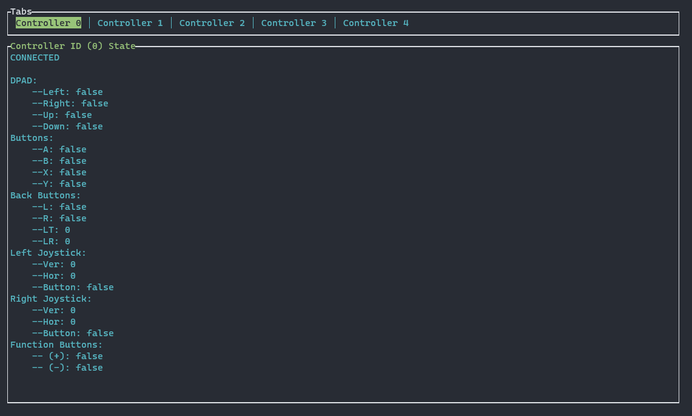
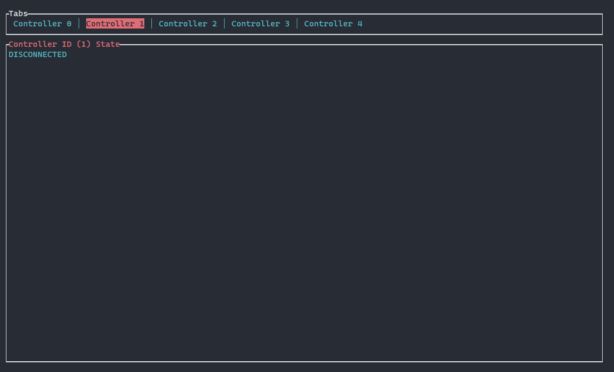

# XInput Controller status visualiser
## How to use:
Execute
```bash
cargo run 
```
And navigate through the tabs with the `p` (previous) and `n` (next) key on the keyboard.
## Connected


## Disconnected
