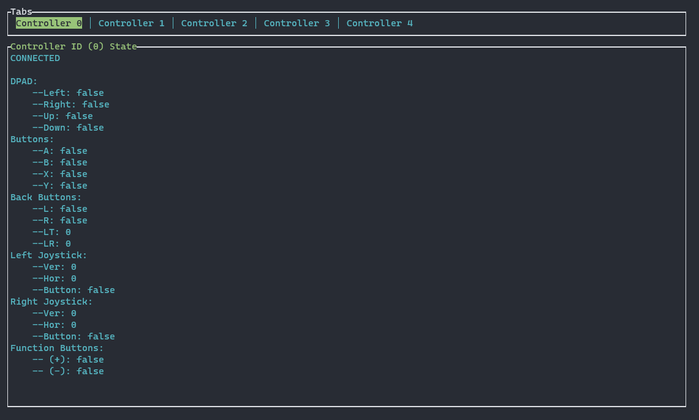
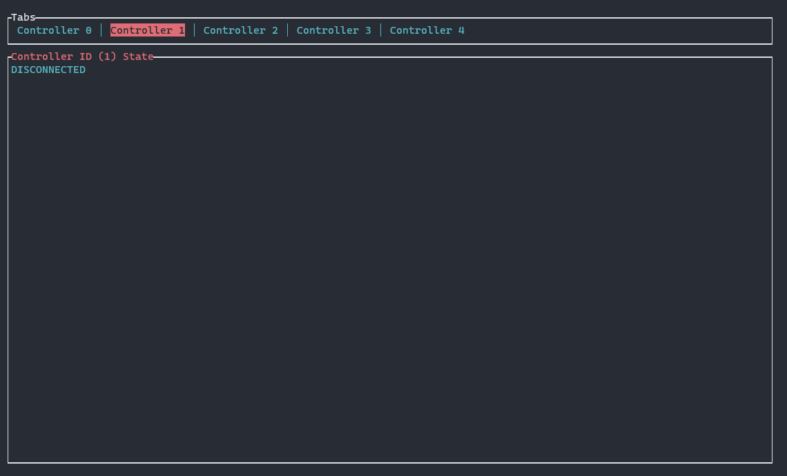

# XInput Controller status visualiser

## How to use

### Execute

```bash
> cargo run
```

### Install and execute as binary

```bash
> cargo install --path .
> xintool
```

Or directly from crates.io

```bash
> cargo install xinput-visualiser
> xintool
```

And navigate through the tabs with the `p` (previous) and `n` (next) key on the keyboard.

## Connected



## Disconnected


